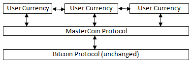
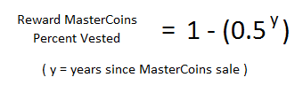
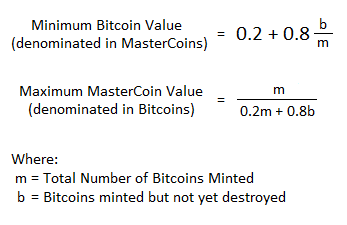
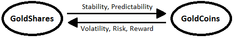
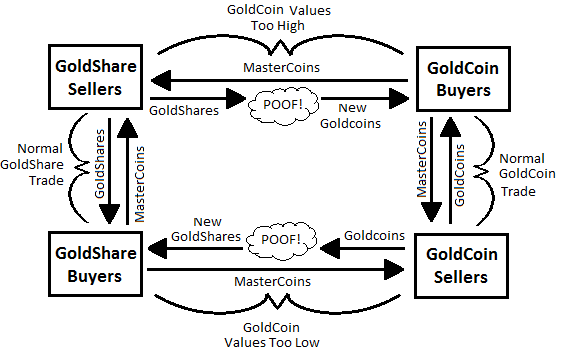
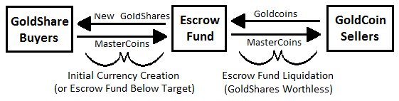

<!--

Version 0.5, published Jan/6/2012:
https://sites.google.com/site/2ndbtcwpaper/2ndBitcoinWhitepaper.pdf

J. R. Willet ->
https://github.com/dacoinminster
-->

# MasterCoin - A Second-Generation Protocol on the Bitcoin Blockchain for Creating and Trading New Currencies

Version 0.5

by J. R. Willet, 2012

## Introduction

### Summary

We claim that the existing bitcoin network can be used as a protocol layer, on top of which new currency
layers with new rules can be built without changing the foundation. We further claim that the new
protocol layers described in this document:

- Will fix the two biggest barriers to widespread bitcoin adoption: instability and insecurity.

- Will financially benefit the entire bitcoin user community, including those who don't use the new protocol layers.

- Will provide initial funds to hire developers to build software which implements the new protocol layers, and ongoing funds to pay for maintenance of this software.

- Will richly reward early adopters of the new protocol, in proportion to how successful it is.

### Assumptions

Our claims are built on the following assumptions:

- Alternate block chains compete with bitcoins financially, confuse our message to the world, and
dilute our efforts. These barriers interfere with the adoption momentum of bitcoin and the
adoption momentum of alternate currencies as well, regardless of how well-conceived their
rules may be.

- New protocol layers on top of the bitcoin protocol will increase bitcoin values, consolidate our
message to the world, and concentrate our efforts, while still allowing individuals and groups to
issue new currencies with experimental new rules. The success of any experimental currency
protocol layer will enhance the value and success of the foundational bitcoin protocol.

- Getting consensus and widespread adoption from the bitcoin community is not needed to add
protocol layers, since no changes to the foundational bitcoin protocol are required.

- Tiny bitcoin transactions can be encoded into the block chain to support and represent
transactions in higher protocol layers. Any protocol transaction described in this document can
be assumed to be represented in the block chain by tiny bitcoin transactions.

- A protocol can pay for its own software development, "bootstrapping" itself into existence,
utilizing a trusted entity to hold funds and hire developers.

- It is possible to create tools to allow end users to create currency protocol layers which have a
stable value, pegged to an external currency or commodity. In this way, users of these
currencies can own stabilized virtual currency tied to U.S. Dollars, Euros, ounces of gold, barrels
of oil, etc.

- It is possible for users of these new currencies to exchange between currencies with each other
using simple rules and no central exchange.

### Visualization

The proposed protocol layers can be visualized as follows, with arrows representing users exchanging
between currencies:

Note that all transfers of value are still stored in the normal bitcoin block chain, but higher layers of the
protocol assign additional meaning to some transactions.

## MasterCoin Design

The "MasterCoins" protocol layer between the existing bitcoin protocol and users' currencies is
intended to be a base upon which anyone can build their own currency. The software implementing
MasterCoins will contain simple tools which will allow anyone to design and release their own currency
with their own rules without doing any software development.

### The "Trusted Entity"

The concept of a "trusted entity" is needed for initial distribution of MasterCoins and initial protocol software development. This entity:

- Should have a publicly known identity and location.

- Should devote the funds received to protocol software development, marketing, and business
expenses. Funds could also be used for legal costs if necessary.

- Should devote any remaining funds to other projects which benefit those who are using the new
protocol layers (banking applications, merchant services, etc)

- Should vow to return all remaining funds to their original owners if they are for some reason
unable to continue working on the software.

- Should commit to financial transparency, and should undergo regular external audits.

- Should obey the laws of whatever country they are situated in, and should be prepared to move
to a different country if necessary.

- Will be given a large (slowly vesting) financial stake in the success of the new protocol layers so
that their interests are aligned with the interests of the early adopters.

Choosing this entity is the first and most important decision to be made if the changes in this document
are to be implemented. We don't expect a shortage of volunteers to manage the money, but we are
very interested in community feedback on who can be trusted to manage it.

### Initial Distribution of MasterCoins

Initial distribution of MasterCoins will essentially be a fundraiser for the trusted entity to provide money
to pay developers to write the software which fully implements the protocol. The distribution is very
simple, and will proceed as follows:

1. The trusted entity publishes the bitcoin addresses to be used for collecting bitcoins as
MasterCoins are sold to the public.

2. The trusted entity publishes the final date at which MasterCoins may initially be purchased (i.e. July 31st, 2012)

3. Anyone sending bitcoins to those addresses before the specified deadline is recognized by the
protocol as owning an equivalent number of MasterCoins.

For instance, if I send 100 bitcoins to the address before the deadline, I own 100 MasterCoins after the
deadline. This ratio will be tweaked slightly to reward earlier buyers more than later buyers.

### Reward MasterCoins

For every 10 MasterCoins sold, an additional "reward MasterCoin" will also be created, which the
trusted entity will receive slowly over the following years. These delayed MasterCoins will ensure that
the trusted entity has plenty of motivation to increase the value of MasterCoins by completing the
features desired by users. The reward will be structured so that they have received 50% of the reward
by one year after the initial sale, 75% by a year later, 87.5% by a year later, and so on:

The 10:1 ratio and 50%/year vesting rate are only suggestions at this point. More or less reward with a
faster or slower vesting rate may be appropriate, depending largely on how widely this document is
accepted, how trusted the entity is, and the likelihood that a different entity will try to supplant them
with a similar enterprise. These factors all impact the likelihood of success, which in turn impacts how
much reward incentive the trusted entity will need.

It is our hope that we (the author's royal/academic we) can endorse an entity who represents the most
trusted choice of the majority of bitcoin users, that the author can work with that entity to make these
ideas into reality, and that the community will be largely behind us, lowering the odds that some other
entity will try to do something similar.

### Ongoing Balance of MasterCoin and Bitcoin Values

If the user currencies based on MasterCoins are even modestly successful, we would expect exponential
growth in MasterCoin values. What then happens to the bitcoins supporting all this?
The value of bitcoins and MasterCoins must be manipulated to support two goals:

1. In order to ensure sufficient hashing power, Bitcoins must gain value at the same time that
MasterCoins gain value.

2. In order to reward early MasterCoin adopters, Bitcoin values must not be forced up as quickly as
MasterCoin values are rising.

To accomplish these two goals, a minimum bitcoin value and maximum MasterCoin value will be set as
follows:

This limit will be enforced by the protocol creating new MasterCoins for sale in exchange for destroying
bitcoins (by sending them to a fake address) whenever the limit is exceeded.

When these new MasterCoins are created, the trusted entity would not receive new bitcoins to spend,
but they would still receive the corresponding reward MasterCoins over time, as described above.

The numbers 0.2 and 0.8 ultimately represent that bitcoin values can never fall under 20% of
MasterCoin values. That is, 5 bitcoins will always be worth at least one MasterCoin. In the event that the
MasterCoin community feels they have too much or too little hashing power, they could change this
minimum bitcoin value by voting on what they believe the minimum bitcoin value should be. Voting is
further described later in this document.

### Using MasterCoins

All transactions and operations involving MasterCoins are encoded into the block chain using tiny bitcoin
transactions. MasterCoins (and user currencies derived from them) will allow a much wider diversity of
transactions, including at least the following:

- I hereby transfer these coins to `<address>`
- I hereby mark these coins (in my savings wallet) as having a 2 week waiting period to complete
any transfer.
- I hereby offer for sale these 10 coins at a price of 5 bitcoins each.
- I hereby accept your offer - I would like to buy 2 of your coins at that price.
- I hereby offer a bet B1 that address X will not send a value greater than Y before date Z. (Y could
represent a sports score, a stock price, or any other data that people might want to bet on.)
- I hereby take your bet B2.
- I hereby create a user currency with the following properties ...

Some of these transactions are elaborated below.

### Distributed Exchange

- Someone who is holding MasterCoins (or a currency derived from them) can simply broadcast a
message that they are for sale, and a price in another currency (such as bitcoins).

- Someone wishing to buy some coins which are for sale can broadcast their intention to buy
some or all of them.

- When a buyer is confirmed in the block chain to be the first to broadcast this intention, they
may then transfer the offered price to the seller, and they are then recognized as the new
owner of the MasterCoins.

- If an offer has not yet been accepted, the seller may broadcast that the coins are no longer for
sale.

### Special Security Features

MasterCoins, and any user currencies based on them, will have additional security features built-in to
increase the confidence people have in holding these currencies. Any holder of such currencies will be
able to place restrictions on their "savings account" such as:

- **Temporary transaction reversibility** - for instance, a user could mark their savings account as
having a 30-day window in which they can reverse any transactions exceeding 10
MasterCoins/month. This reversal would be accomplished by sending a coded transaction from
a secondary wallet file they control. Any reversible transfer would not be considered complete
until the window was past.

- **Multiple Signers** - a user could require large transactions from their online wallet to also be
approved by a confirming transaction from the wallet on their home PC, or vice-versa. Similarly,
a virtual company could require that a majority of stakeholders sign-off on large expenditures.

- **Duress Protection** – To discourage kidnapping and other forms of payment under duress, a user
can appoint a trusted entity with the power to prevent or slow large transactions which they
believe to be made under duress. Kidnappers and corrupt governments would know that no
matter how much the currency owner is motivated to pay them off, they simply cannot until
they can prove to this arbitrator that they and their loved ones are not being threatened.

- **Arbitration** - A user will also be able to designate other trusted entities to arbitrate In the event
that a hacker is attempting to gain control of their wallets, ensuring that the funds return to the
proper owner.

### Conditional Transfers

MasterCoins, and any user currencies based on them, will support transfers which are conditional, that
is, dependent on another transaction. In this way, users can bet on any data which is published in the
block chain. For instance:

1. User A starts publishing a stock price from his bitcoin address

2. User B publishes a bet that the stock price will fall below $2 in the next 7 days. User B's money is
now locked until the bet is over or he withdraws the bet offer

3. User C accepts the bet. Money for User B and User C is locked until the bet is over.

4. If user A publishes a value below $2 or 7 days passes, the protocol recognizes the winner as the
new owner of the funds that were bet.

No middleman website is needed. Betters only need to trust the data source and the shared protocol.
We expect that betting on financial instruments, sports, and world events using user-created currencies
will become very widespread. MasterCoins will probably be too volatile to be used in betting.

## User Currencies

The whole point of MasterCoins is to allow users to create their own currencies out of existing
MasterCoins. For the purposes of demonstrating how user currencies will work, we will use an example
currency called "GoldCoins", which are intended to track the value of one ounce of gold, and which may
be stored, transferred, bought, and sold similarly to MasterCoins.

### Stability Concept

The first problem is how to drive the value of these GoldCoins to their target value, when demand for
them may surge and decline. The price of GoldCoins is decided by the balance of supply and demand.
Since we can't control the demand for GoldCoins, we must control the supply.

The key to accomplishing this is a transfer of volatility from holders of the stabilized currency (who want
stability) to speculators (who want risk and reward). In order to transfer volatility, we need to split the
currency into two parts, GoldCoins and GoldShares:

### Publishing the User Currency Value

How does everyone agree on what the value of one ounce of gold is? The creator of the
GoldCoins/GoldShares currency is responsible to designate a "ticker" bitcoin address which periodically
publishes the value of an ounce of gold (denominated in bitcoins, MasterCoins, or another user currency
such as USDCoins) with a tiny bitcoin transaction. If for some reason that address is compromised or
starts publishing invalid data, currency stakeholders (GoldCoin and GoldShare holders) can vote to use a
different ticker.

### Stability Mechanism

The volatility transfer is accomplished by destroying GoldShares (and issuing new GoldCoins) when
GoldCoin values are too high, and by destroying GoldCoins (and issuing new GoldShares) when GoldCoin
values are too low:

Owning GoldShares is equivalent to betting that demand for GoldCoins will rise. Owning GoldCoins is
equivalent to owning ounces of gold (betting that the value of gold will rise).

### Escrow Fund (Insurance Against Panic)

As with everything else in the world, both GoldCoins and GoldShares derive their value from the
confidence people have in them to be worth something in the future. What if something better comes
along, and nobody wants GoldCoins OR GoldShares anymore? What if people panic and everybody tries
to sell their GoldCoins and GoldShares at once? To handle the eventual demise of GoldCoins (tomorrow
or in a thousand years) we propose an escrow fund of MasterCoins to be held as insurance for each
user-created currency.

For example, when the GoldCoins currency is first created, MasterCoins would be stored in escrow in
exchange for the first GoldShares purchased by speculators. As long as the GoldShares have some value
above zero, GoldCoin stability can be maintained. If GoldShare values fall to zero, the protocol will begin
buying GoldCoins in exchange for the stored MasterCoins worth some amount probably less than the
face value of the GoldCoins, depending on the size of the escrow fund:

Thus, as long as MasterCoins have value, GoldCoins are worth something because of the MasterCoins
held in escrow. Panic selling can be further discouraged by liquidating the escrow fund in a way that
rewards those who wait longer to cash in their GoldCoins. For instance, if 10% of the escrow fund is used
to purchase 20% of GoldCoins outstanding, there are more MasterCoins in the escrow fund per
outstanding GoldCoin that users held onto.

This culling process might even jump-start the currency to life again as GoldCoins approach their target
value and GoldShare speculators wonder if demand for GoldCoins might again exceed supply. As
GoldCoin values rose, the old worthless GoldShares would undergo a reverse split (i.e. 1 Million
GoldShares might eventually become 1 GoldShare, since the market got flooded with GoldShares as the
initial crash happened). Once GoldCoins regain their target value, there are only a small number of
GoldShares left from the original batch (the exact number left would be determined by the currency
creator when they launched GoldCoins). At this point, new GoldShares are sold, the escrow fund is
replenished, and life goes on.

One interesting side effect of the potential exponential rise in MasterCoin values is that early user
currencies may find themselves with a large surplus in escrow. The creator of GoldCoins would decide at
the beginning what to do with these funds - to what extent they should be distributed to GoldShare
holders, or held in escrow to increase the attractiveness of GoldCoins to users.

### New Currency Creation

At the time GoldCoins are created, the user must decide the following:

- Ticker symbol ("GLD")

- Short name for what is being tracked ("Gold", which will determine "GoldCoins" and "GoldShares")

- Long name for what is being tracked ("US dollar value of one ounce of gold")

- Bitcoin address which will publish the ticker

- Compact URL pointing to a webpage with more information about the currency (i.e. `tinyurl.com/aboutgoldcoins/`)

- Various parameters governing the currency's behavior, such as:

  - The minimum allowed value of funds to be stored in escrow before correctional action is
    taken (i.e. "When the escrow fund falls below 50% of the face value of all outstanding
    GoldCoins, the protocol shall sell new GoldShares on the open market until the escrow
    fund is restored to 50% or GoldShare values fall to zero.")

  - The maximum allowed value of funds to be stored in escrow (i.e. Escrow funds
    exceeding 150% of the face value of all outstanding GoldCoins shall be used by the
    protocol to buy back GoldShares on the open market.)

  - "Proportional" gain of the PID loop governing value corrections (i.e. "Increase GoldCoin
    supply by 1% per year for every 2% GoldCoins are below target. Decrease GoldCoin
    supply by 1% per year for every 3% GoldCoins are above target.")

  - "Integral" gain of the PID loop governing value corrections (i.e. "Increase GoldCoin
    supply by 1% per year for every 1% GoldCoins stay below their target value multiplied
    by the number of years they have been below target. Decrease GoldCoin supply by 1%
    per year for every 0.5% GoldCoins stay above their target value multiplied by the
    number of years they have been above target.")

  - "Differential" gain of the PID loop governing value corrections (i.e. "Increase GoldCoin
    supply by 1% per year for every 5% per year GoldCoin values drop against their target.
    Decrease GoldCoin supply by 1% per year for every 7% per year GoldCoin values rise
    against their target.")

- Parameters governing crashes (GoldShare values falling to zero) and recoveries (GoldCoin values
  regaining their target), such as:

  - What constitutes a crash (i.e. "If GoldShare values fall to zero and then in the next 48
    hours do not achieve a price above zero for more than 8 consecutive hours, the
    currency is considered to be crashed and escrow fund liquidation will begin.")

  - Aggressiveness of increasing GoldCoin values when liquidating the escrow fund (i.e.
    "When liquidating the escrow fund, 5% of the fund should be liquidated each time 10%
    of GoldCoins outstanding are purchased, as GoldCoin holders choose to sell at that
    price. That 5% figure shall rise at the rate of 2% per year until the escrow fund is
    completely liquidated or GoldCoins regain their target value.")

  - Ratio of old GoldShares to new GoldShares after a crash recovery (i.e. "If GoldShare
    prices should crash to zero, GoldShares will be reverse split such that 10000 GoldShares
    remain outstanding. If GoldCoins later regain their target value, increase GoldShares by
    10% per day until the escrow fund regains its minimum value or GoldShare values reach
    zero again.")

- Parameters governing voting, such as:

  - Number of shares/coins required to propose a change (i.e. "Individuals proposing a
    change must control 0.5% of GoldShares or 0.5% of GoldCoins or an equivalent
    combination of the two such as 0.4% of GoldShares and 0.1% of GoldCoins)

  - Number of shares/coins required to endorse a proposed change before it is put to a
    vote (i.e. "Proposed changes must be endorsed by 10% or GoldShares or 10% of
    GoldCoins or an equivalent combination of the two such as 2% of GoldShares and 8% of
    GoldCoins")

  - Number of days for which votes are collected from GoldShare and GoldCoin holders (i.e.
    30 days)

  - Percentage of votes in favor of a change required to make the change official. (i.e. For a
    proposal to be adopted, 50% of GoldShare voters AND 50% of GoldCoin voters must
    vote for it, or an equivalent combination of the two, such as 80% of GoldShare holders
    and 20% of GoldCoin holders)

- Amount of MasterCoins to pay to the ticker registry address. This determines the placement of
  the ticker in the list that users see, represented by transactions sent to a bitcoin address owned
  by the trusted entity. Paying more than a trivial amount is optional, and merely demonstrates
  that the currency creator is serious in their commitment to making the currency a success.

This information and any other similar information is published into the block chain, and the currency
creator (and anyone else) can buy some GoldShares to kick things off. Once the values above are set,
they can only be changed by a vote of the currency stakeholders (GoldCoin and GoldShare holders), as
implied by the rules above.

Note that changes to the MasterCoin protocol would require ratification by a similar voting system for
holders of MasterCoins and the currencies which hold MasterCoins in escrow.

## Appendix A - Legal Issues

We believe that the trusted entity can avoid liability for any laws broken by users of new protocol layers.
For instance, if a government-issued currency loses value due to the rise of distributed currencies, that
government might wish to mount a legal attack against the trusted entity for engaging in "economic
terrorism".

The counter-argument would be that the protocol and software merely provide a set of tools which can
be used by anyone to create and use new currencies pegged to external values of the users' choosing.
As with file-sharing, there are many uses for such a protocol, some legal, some not. Any software tools
released for the creation and use of user-generated currencies should explicitly warn users to determine
for themselves the laws pertaining to the legality, regulation, and taxation of any new currency
protocols they create or use.

In the event that laws are passed that specifically target distributed currencies, the trusted entity must
be prepared to move to a country with a more favorable legal climate.

## Appendix B – Moral Issues

While moral issues are outside the traditional scope of a whitepaper such as this, we feel compelled to
raise them.

Modest success of this protocol could make early investors (and even those who simply hold bitcoins)
very rich, hopefully without much disruption to the rest of the world. However, should this protocol and
its children (or perhaps some other similar protocol) become more than modestly successful and start to
replace traditional currencies, the consequences could be huge, possibly even apocalyptic. Early
investors could be the richest people in the world, maybe even trillionaires by today's accounting. The
social and economic upheaval could be cataclysmic, and many people could suffer greatly if the
transition is not handled well by governments and the new rich.

We urge our readers to examine their hearts, and to engage in more constructive fantasies than buying
fast cars and private islands. Are you willing to devote the vast majority of your wealth to helping people
in need, especially those who suffer because of the forces that made you rich? Will you pursue new
entrepreneurial projects which create jobs for these people? Will you help your government adapt to
the new paradigm? Will the world be a better place because of your good fortune? The suffering of
these people will be on all of our heads, and they (and a higher power) will hold us accountable if we
behave selfishly.

In such a world, we must all encourage each other to do the right thing, by words and by example.

## Appendix C – Disclaimer

Investing in experimental currencies is really, absurdly risky. This paper is not investment advice, and
anyone predicting what will happen with experimental currencies such as those described here is
indulging in the wildest sort of speculation, and that includes the speculations in the previous appendix.

Please consult your financial adviser before investing in ANY wild scheme such as this (hint: they will
probably tell you to RUN and not look back unless you assure them that it is money you are totally
prepared to lose).

Anyone who puts their rent money or life savings into an experiment of this type is a fool, and deserves
the financial ruin they will inevitably reap from this or some other risky enterprise.

